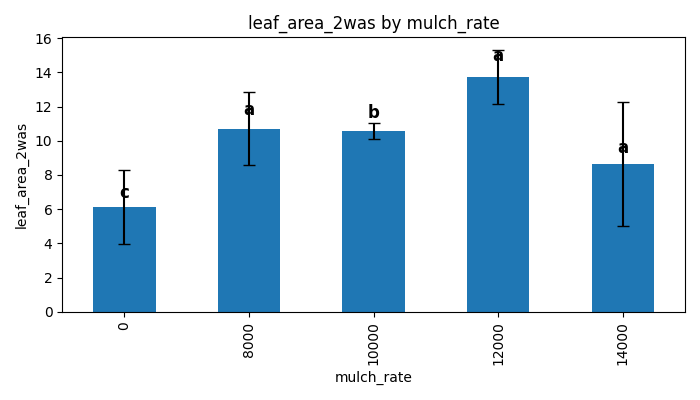

# 🌱 Neem Mulch Rate Analysis Tool

A **Python-based analysis pipeline** for evaluating the effect of **neem leaf mulch rates** (or any other treatments) on crop growth and yield parameters.  

This script performs:

- **ANOVA (F-test)** to check for significant differences.
- **LSD (Least Significant Difference) post-hoc test** when ANOVA is significant.
- **Automatic bar chart generation** with group lettering.
- **Export of results** to Excel and a nicely formatted Word report (including ANOVA tables, LSD results, and plots).

Perfect for agronomic experiments with multiple treatments and replicates.

---

## 📊 Example Use Case

This project was designed for analyzing field experiments such as:

- **Mulch rate trials** on okra, kale, tomatoes, etc.
- Multiple parameters like:
  - 🌱 Percentage emergence  
  - 📏 Plant height  
  - 🌿 Number of leaves  
  - 🌱 Stem girth  
  - 🌐 Leaf area  
  - 🍅 Number of fruits & fresh weight  

Simply point it to your Excel file — it will detect and analyze every numeric parameter automatically.

---

## 🛠 Features

- ✅ **Dynamic variable detection** – works with any dataset with a `mulch_rate` (or treatment) column  
- ✅ **ANOVA Table Output** – printed to console, saved to Excel, and added to Word report  
- ✅ **Post-hoc LSD Grouping** – groups treatments with statistical letters (a, b, c...)  
- ✅ **Plot Generation** – bar charts with letters annotated above bars  
- ✅ **Clean, reproducible workflow** – perfect for research documentation  

---

## 📦 Installation

- Make sure you have **Python 3.8+** installed, then install dependencies
- Clone this repository and install the required dependencies:
```bash
git clone https://github.com/Johnkenzzy/neem_leaf_mulch_rates.git
cd neem_leaf_mulch_rates
```
- Install dependencies
```bash
python -m venv .venv
. .venv/bin/activate
python -m pip install -r requirements.txt
```

---

## 🚀 Usage

- Run the script from the command line, passing:
  - The Excel file path
  - The sheet name to analyze

```bash
python engine.py path/to/data.xlsx Sheet1
```

---

## 📂 Output

- After running, the script generates:
  - 📑 analysis_results.xlsx – Summary table with means and LSD group letters
  - 📝 analysis_report.docx – Word report containing:
    - ANOVA tables
    - LSD group tables (if significant)
    - Plots with annotated group letters
  - Plots are also saved as separate PNG files per variable.

## 🖼 Example Plot

|  |
|:--:|
| *Bar plot with LSD group letters automatically annotated.* |

---

## 🧠 How It Works

1. Reads Excel file → uses exact column names (no renaming).
2. Runs ANOVA (ols model + statsmodels.anova_lm).
3. Checks significance (p < 0.05):
  - If significant → runs LSD post-hoc test
  - If not → logs "No significant difference"
4. Generates bar plots with error bars and group letters
5. Exports results to Excel + Word report for publication-ready output

---

## 🧪 Tested With

- ✅ Okra dataset (0 – 14,000 kg/ha neem mulch)
- ✅ Kale dataset (similar structure but different variables)
- ✅ Tomato dataset (similar structure but different variables)
- ✅ Works with any crop as long as mulch_rate column exists

---

## 🤝 Contributing

Want to improve this tool?
Feel free to fork this repo, submit pull requests, or open an issue for feature requests or bug reports.

---

## 📜 License

- MIT License – free to use, modify, and share for research and academic purposes.